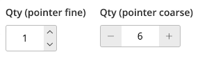

# Siteation - Magento 2 Module Enhanced Qty

[](https://packagist.org/packages/siteation/magento2-module-enhanced-qty)

This Magento 2 module adds qty buttons next to each qty input field.
Making it easier for your store customers to increase or decrease the quantity,
of a product.



_[View more previews of the Enhanced Qty](previews)_

<details><summary><strong>TOC</strong></summary>

- [Installation](#installation)
- [How to use](#how-to-use)
  - [SCSS support](#scss-support)
- [Config](#config)
  - [Render Javascript config](#render-javascript-config)
  - [Enhanced Qty Javascript config](#enhanced-qty-javascript-config)
  - [Styling config](#styling-config)
- [Tips](#tips)
  - [Also show on the product grid](#also-show-on-the-product-grid)

</details>

## Installation

Install the package via;

```bash
composer require @siteation/magento2-module-enhanced-qty
bin/magento setup:upgrade
```

> This Module require Magento 2.3 or higher!
> For more requirements see the `composer.json`.

## How to use

No instructions needed.
This module works out of the box for themes based on Luma theme.

The module is a progressive enhancement.
And does not change the default behavior of the Magento 2 qty field.
Also it does not overrides any templates except for the minicart KO template.

The `render-qty-btn.js` will add the qty buttons based on the input fields.
And the `enhanced-qty.js` will handle the increment and decrement.

### SCSS support

This module also supports SCSS styles.
That can be used with tools like [Frontools](https://github.com/SnowdogApps/magento2-frontools).

Add `Siteation_EnhancedQty` to the themes.json;

```json
{
    "<THEME>": {
        "modules": {
            "Siteation_EnhancedQty": "vendor/siteation/magento2-module-enhanced-qty/view/frontend"
        }
    }
}
```

And import it in your `styles.scss` via;

```scss
@import "../Siteation_EnhancedQty/styles/module";
```

## Config

### Render Javascript config

There are some option for the render function.
You can pass the option;

```html
<script type="text/x-magento-init">
{
    ".input-text.qty": {
        "renderQtyBtn": {
            "wrapperClass": "enhanced-qty",
            "btnClass": "qty-btn",
            "btnPlusText": "Increase",
            "btnMinText": "Decrease"
        }
    }
}
</script>
```

### Enhanced Qty Javascript config

The enhanced qty has no config.
But will check for specific html attributes.

- `min` the minium
- `max` the maximum value
- `step` the value steps that it will jump when incrementing or decrementing

So changing these values will also impact the enhanced qty buttons behavior.
Giving the same behavior as the html input field.

### Styling config

The enhanced qty comes out of the box with 2 styles.
Each rendered based on what pointer is available.

You can disable or change this behavior via the variables.

If you like to use pointer fine styles also for mobile.

Simple set the vars to;

```less
@enhanced-qty-layout: "input plus" "input min";
@enhanced-qty-layout-fine: false;
@enhanced-qty-btn-size: 1.8rem;
@enhanced-qty-btn-icon-increase: @icon-up;
@enhanced-qty-btn-icon-decrease: @icon-down;
```

This will disable the pointer styles.
And set the default layout to the layout used by the fine layout.

Since the enhanced qty uses css grid templates areas.
You can easily change the layout via just 1 or 2 simple variables.

## Tips

### Also show on the product grid

The enhanced qty will also work if the qty box is added to the product grid.

To show it on the product `list.phtml` add the follwing code before the cart button.

```php
<div class="control">
    <input type="number"
        name="qty"
        id="qty-<?= /* @noEscape */ $_product->getId(); ?>"
        min="1"
        value="1"
        title="<?= $escaper->escapeHtml(__('Qty')); ?>"
        class="input-text qty form-control">
</div>
```
